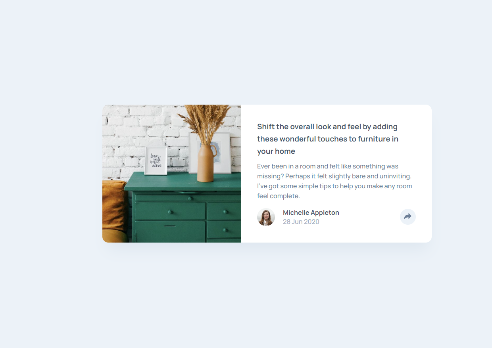
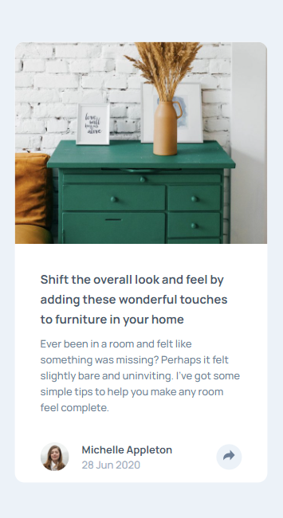
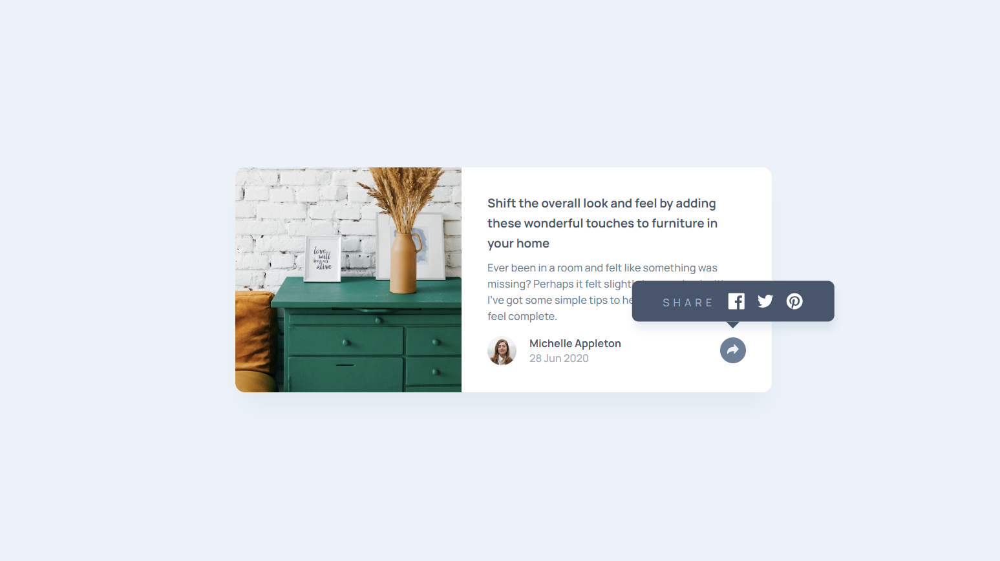
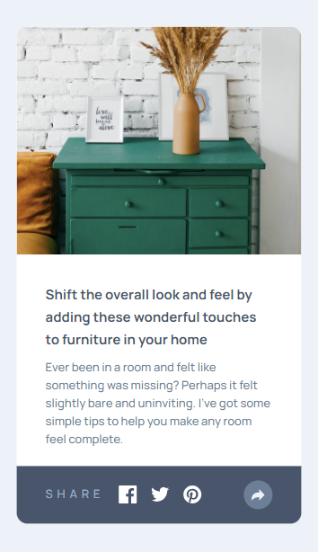

# Frontend Mentor - Article preview component solution

This is a solution to the [Article preview component challenge on Frontend Mentor](https://www.frontendmentor.io/challenges/article-preview-component-dYBN_pYFT). Frontend Mentor challenges help you improve your coding skills by building realistic projects.

## Table of contents

- [Overview](#overview)
  - [The challenge](#the-challenge)
  - [Screenshot](#screenshot)
  - [Links](#links)
- [My process](#my-process)
  - [Built with](#built-with)
  - [What I learned](#what-i-learned)
  - [Continued development](#continued-development)
- [Author](#author)

## Overview

### The challenge

Users should be able to:

- View the optimal layout for the component depending on their device's screen size
- See the social media share links when they click the share icon

### Screenshot

| Desktop | Mobile |
| ------- | ------ |
|||
||

### Links

- Solution URL: [Repository](https://github.com/iArmanKarimi/challenge-article-preview-component)
- Live Site URL: [Github.io](https://iarmankarimi.github.io/challenge-article-preview-component)

## My process

### Built with

- Tailwind CSS
- [React](https://reactjs.org/) - JS library

### What I learned

using and configuring Tailwind css

### Continued development

refer to issues

## Author

- Website - [Arman Karimi](https://github.com/iArmanKarimi/iArmanKarimi.github.io)
- Frontend Mentor - [@iArmanKarimi](https://www.frontendmentor.io/profile/iArmanKarimi)
